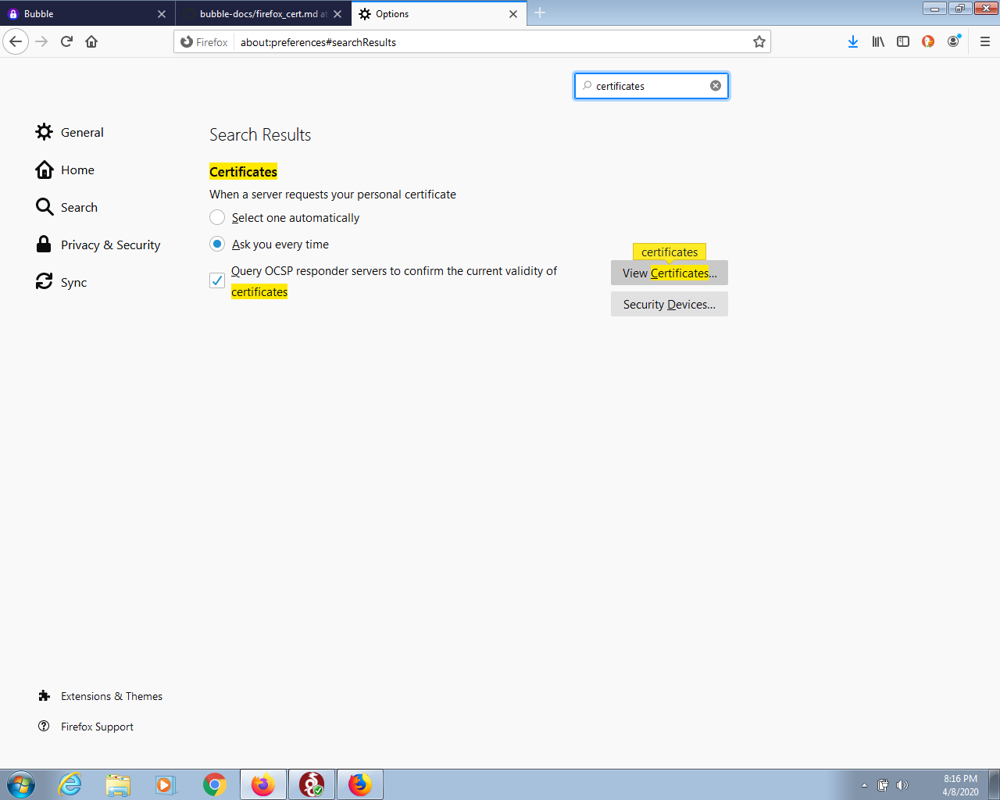
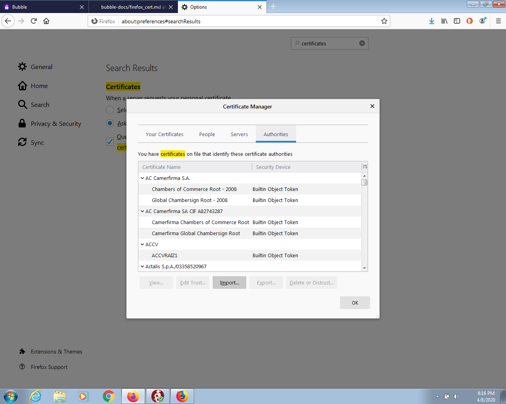
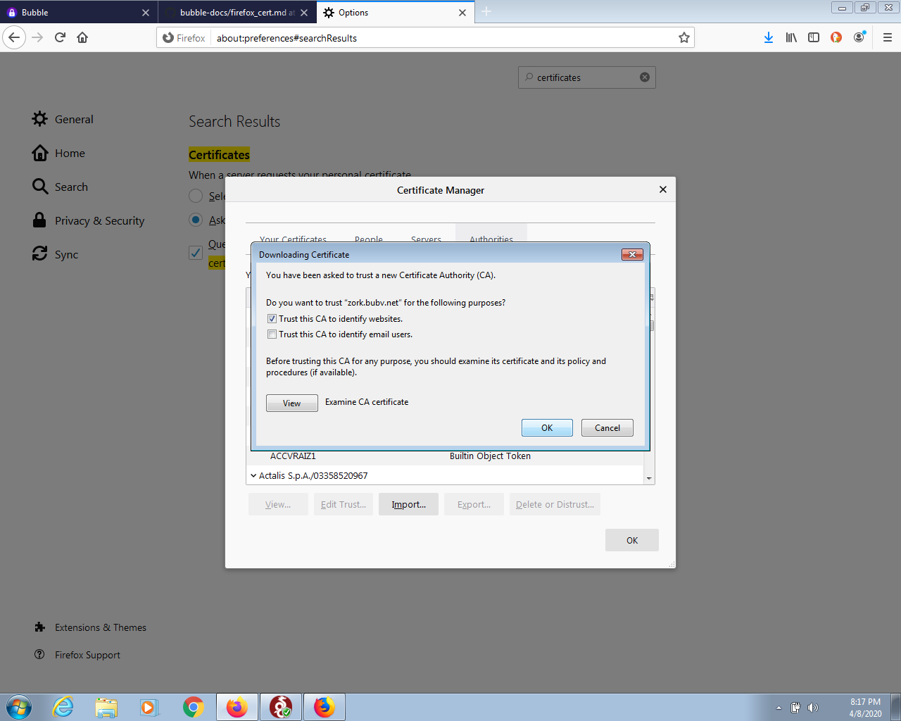
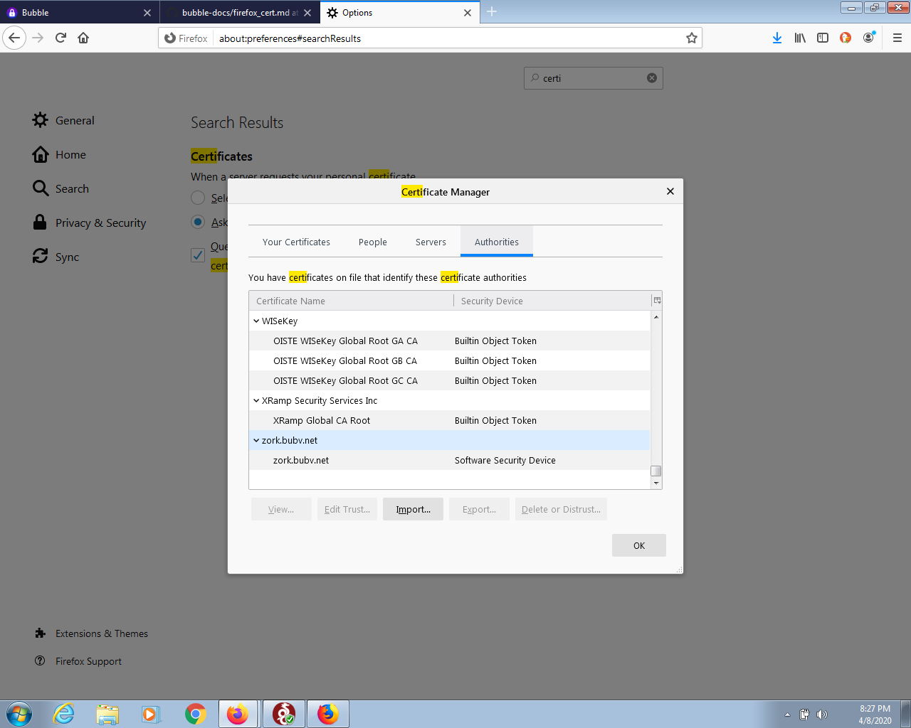

# Install your Bubble Certificate in Firefox

### Download the Certificate
  * Start Firefox
  * Login to your Bubble
  * Go to "Devices"
  * In the "Download Certificate" section, click "Firefox"
  * Save the certificate file

### Install the Certificate
  * Start Firefox
  * Enter "about:preferences" in the URL bar and hit Enter
  * In the search box, type "certificates", you should see something like the screenshot below.

 
  
  * Click the "View Certificates" button
  * You should now see the Certificate Manager, as shown in the screenshot below. Click the "Import" button.

 

  * Select the certificate file you downloaded above.
  * Check the box "Trust this CA to identify websites" and click "OK", as shown in the screenshot below.

 

  * If you scroll down, you should now see your newly installed Bubble Certificate among the list of Authorities in the Certificate Manager, as shown below. Click "OK" to close the Certificate Manager.

 

  * Congratulations! You have successfully installed your Bubble certificate in Firefox!
