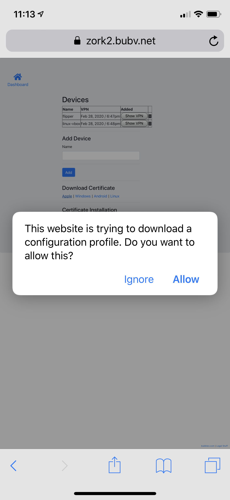
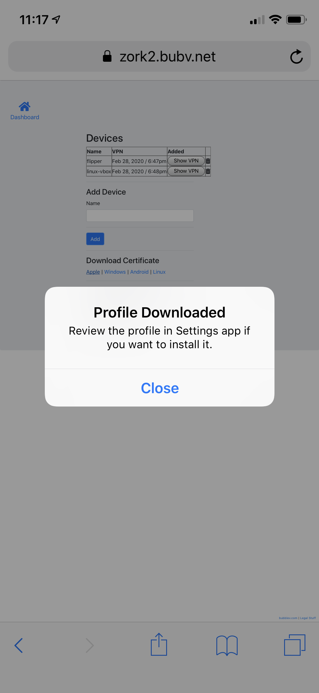
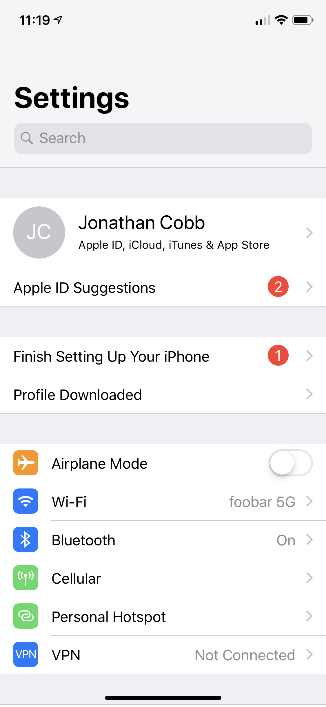
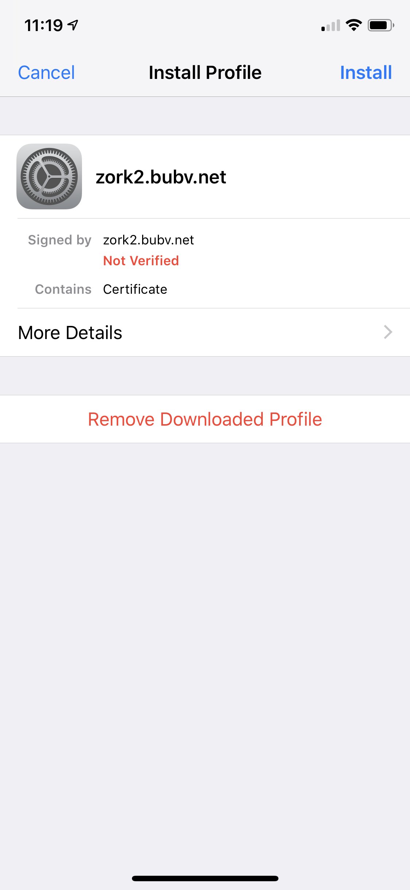
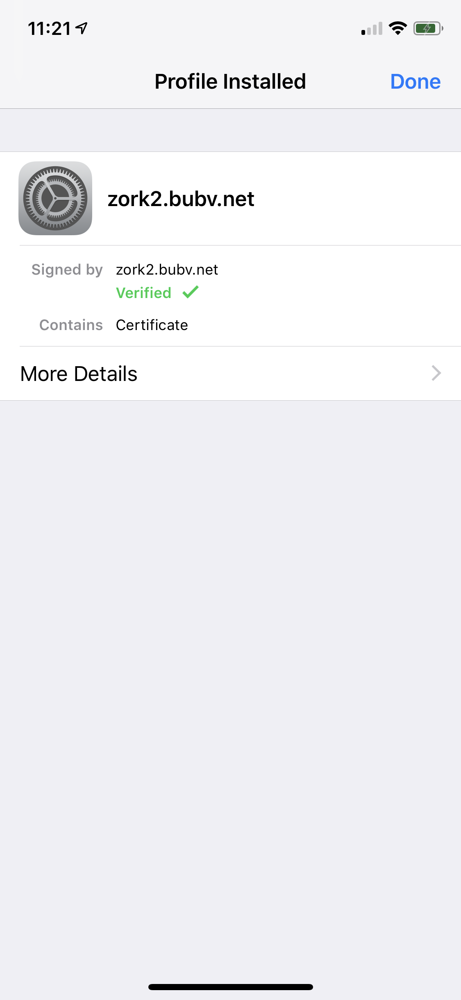
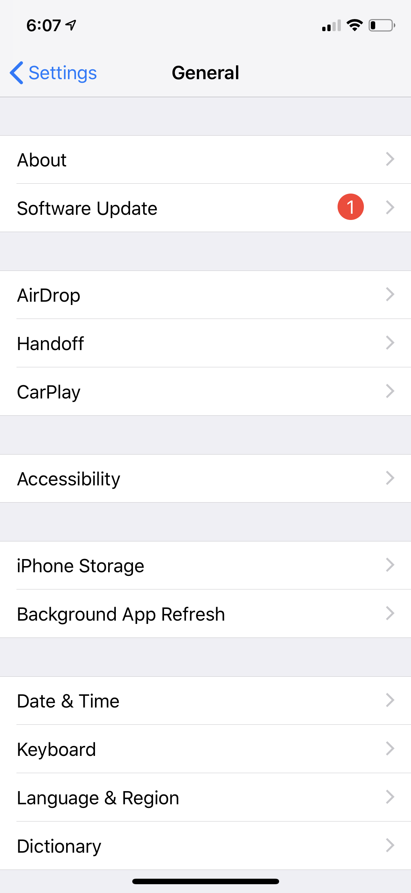
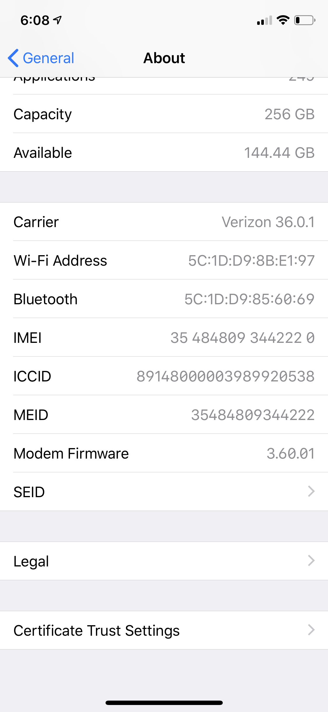
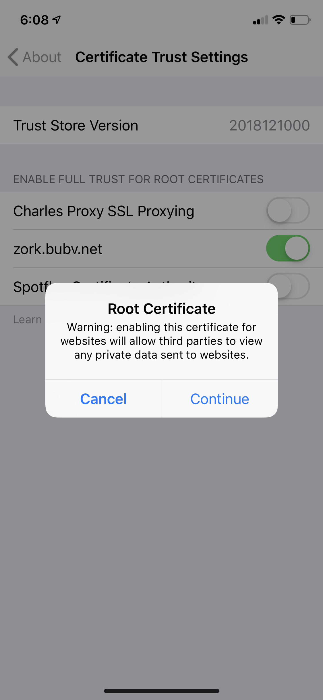

# Install your Bubble Certificate on an Apple iOS device
 
 * Note: You must use Safari to download your Bubble certificate. If you're using Firefox or Chrome, switch to Safari before downloading the certificate.
 * Using your iOS device, log in to your Bubble and tap "Devices"
 * You should now see a list of your devices. Find your iOS device and tap the "iOS" link to download the certificate.
 * After tapping on the "iOS" link you should see a popup asking you to confirm, as in the screenshot below
 
 
 * Tap "Allow" to download the profile
 * You should now see a pop-up titled "Profile Downloaded" as in the screenshot below. Tap the Close button on this pop-up.
 
 
 * Open the "Settings" app on your phone. You should see a "Profile Downloaded" section near the top of your Settings screen, see screenshot below for an example. Tap "Profile Downloaded"
 
 
 * You should now see a profile screen that matches the name of your Bubble, like the screenshot below. In the top-right corner of the screen, tap "Install"
 
 
 * You'll see a "Warning" screen with a message about the certificate. In the top-right corner of the screen, tap "Install". An "Install" button will now appear at the bottom of your screen - tap this "Install" button to finish installing the certificate.
 * You'll now be back on the certificate screen and it should show a green "Verified" message, like in the screenshot blow. In the top-right corner of the screen, tap "Done"
 

 * Tap the "Back" button in the top-left corner of the screen to access General Settings. If you've closed your Settings app, re-open Settings and scroll down to "General", tap "General"
 * At the top of the General Settings screen (screenshot below), tap "About"
  
 
 * Scroll all the way to the bottom of the "About" screen and tap "Certificate Trust Settings", see screenshot below
  
 
 * You should now see the certificate you just installed. Tap the toggle switch to enable it.
 * When you tap the toggle switch, you'll see a warning like the screenshot below. You'll see the message "Warning: enabling this certificate for websites will allow third parties to view any private data sent to websites." This is OK, there is no third party here -- your Bubble is only yours. Tap "Continue"
  
 
 * Congratulations! You have successfully installed your Bubble certificate!
