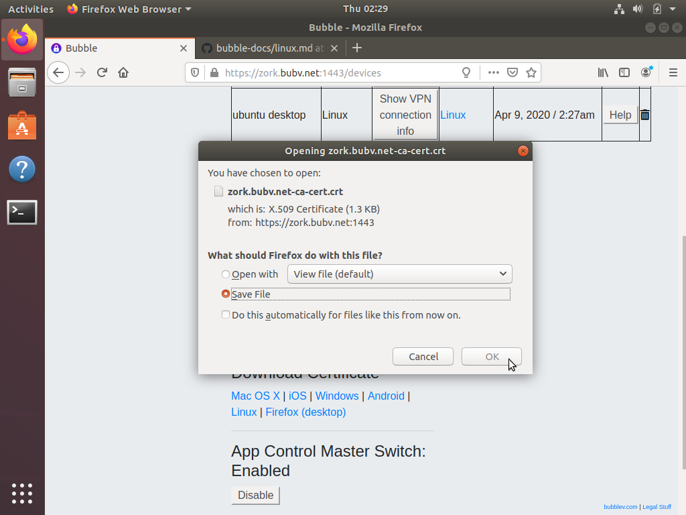
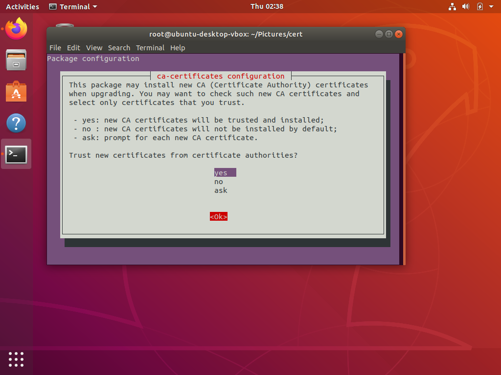
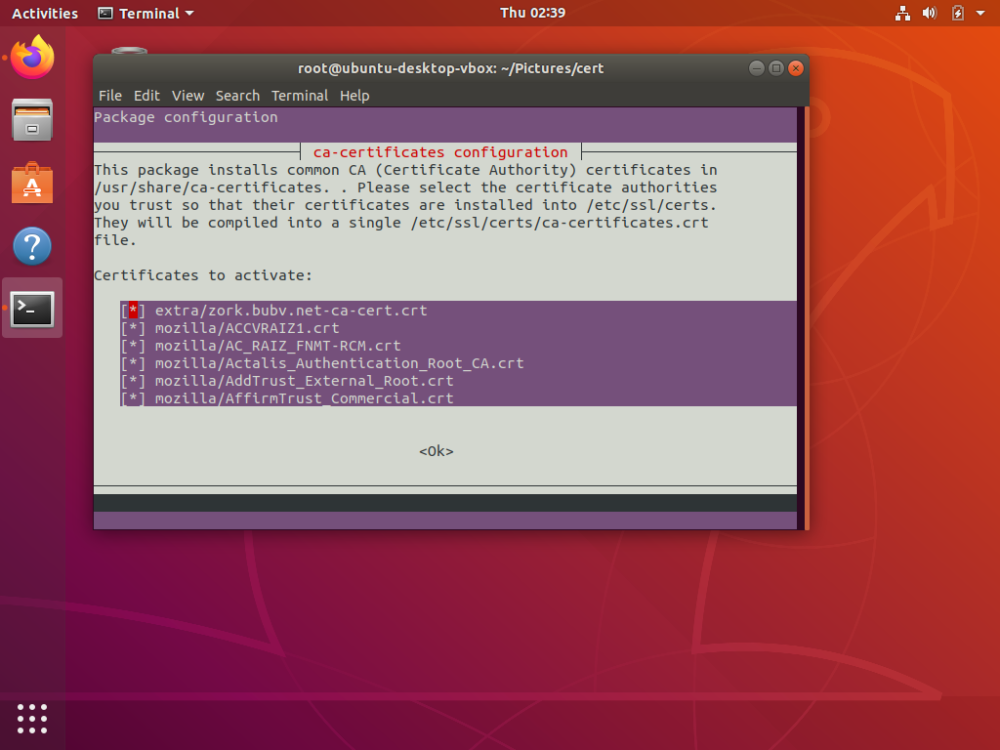

# Install your Bubble Certificate on a Linux system

## Ubuntu

 * Login to your Bubble
 * Click "Devices"
 * In the "Download Certificate" section, click "Linux"
 * A file dialog may open, like the one shown below. Select "Save File" and click "OK" to save the file.

 

 * Open a terminal. If you are not root, become root. If you have sudo privileges, try `sudo bash`
 * As root, copy the certificate file you just downloaded to `/usr/share/ca-certificates/extra`. Create this directory if it does not already exist. For example:

        mkdir -p /usr/share/ca-certificates/extra                                        # ensure directory exists
        cp ~/Downloads/MY_BUBBLE_NAME-ca-cert.crt /usr/share/ca-certificates/extra     # copy certificate
  
  Where `MY_BUBBLE_NAME` is the name of your Bubble.

 * After you've copied the certificate, you'll need to tell Ubuntu that it is OK to use. Continuing as root, run
 
        dpkg-reconfigure ca-certificates

 * You'll see the question "Trust new certificates from certificate authorities?", as in the screenshot below. Select "Yes" and press Enter

 

 * You'll see a list titled "Certificates to activate". Your new Bubble certificate should appear at the top. If it is not selected, press the space bar to select it. A representative screenshot is shown below:

 

 * Press Tab to make the `<Ok>` button active, then press Enter to continue
 * Congratulations! You have successfully installed your Bubble certificate!
 * NOTE: if you use the Firefox web browser, you must also separately [install your Bubble Certificate in Firefox](firefox_cert.md)

## Other Linux Distributions

You should be able to connect any kind of Linux system to Bubble. To install the Bubble certificate on any Linux system, the steps would be:

  * Download the certificate file
  * Tell your system that the certificate file is a trusted CA Certificate

The last step above usually involves copying the certificate file to a special place in the filesystem, and then performing some kind of refresh.

We happily welcome pull requests for other Linux distros so we can update this file with more detailed descriptions for other Linux users.
