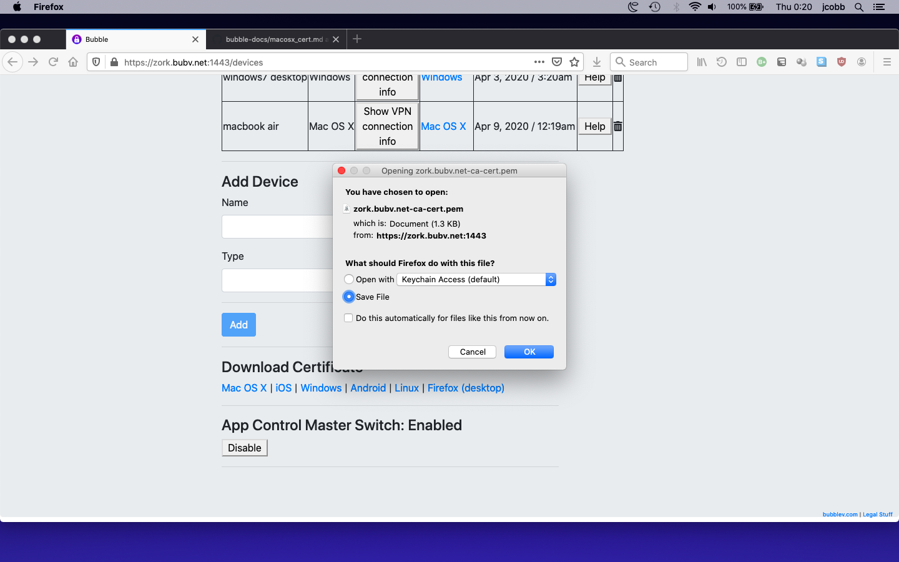
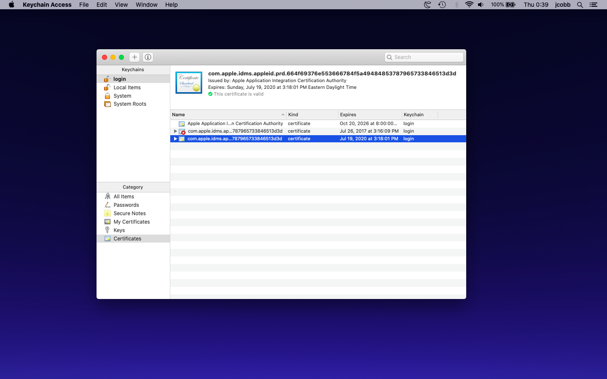
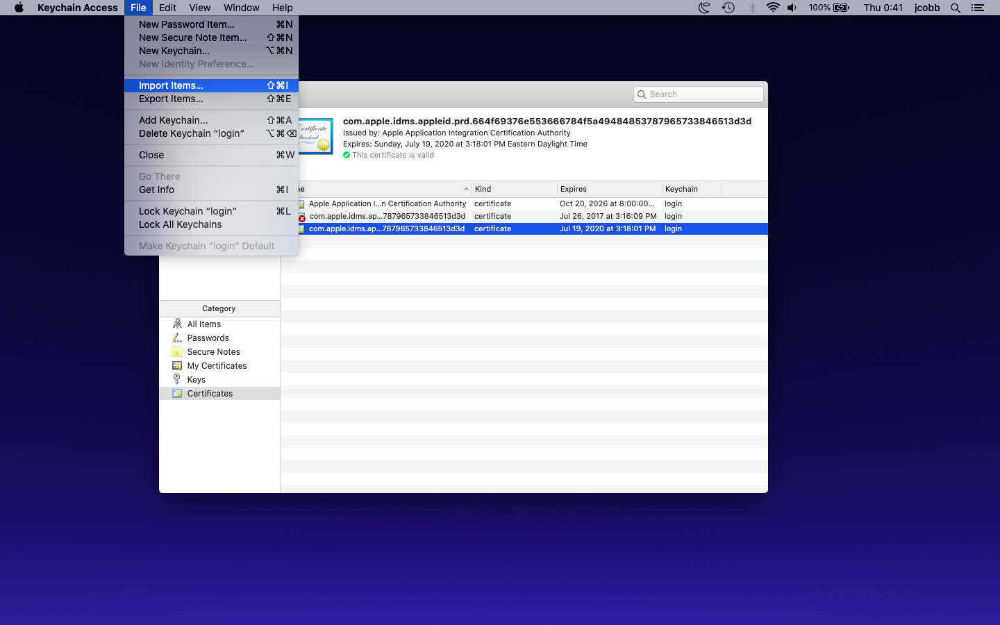
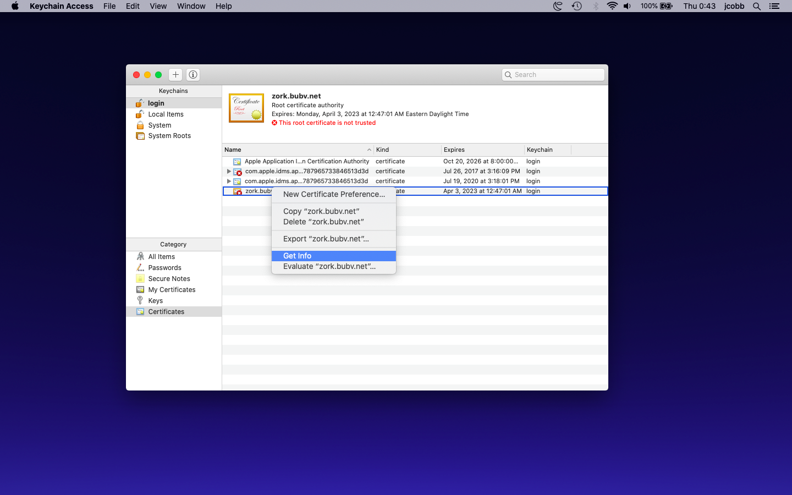
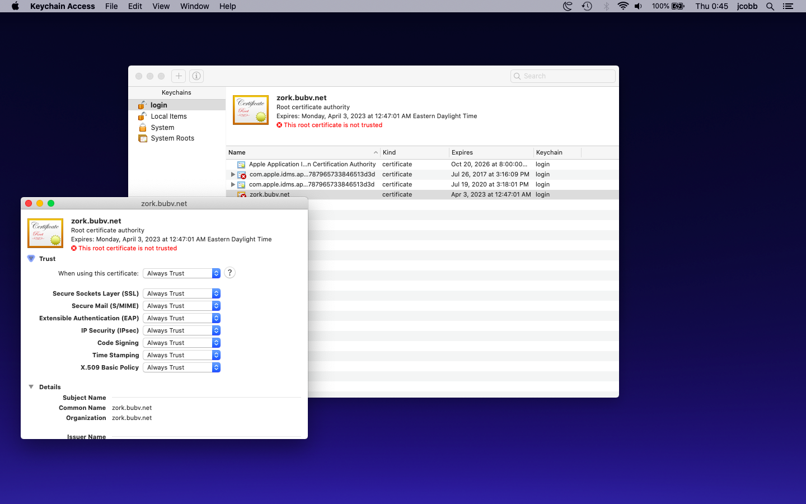
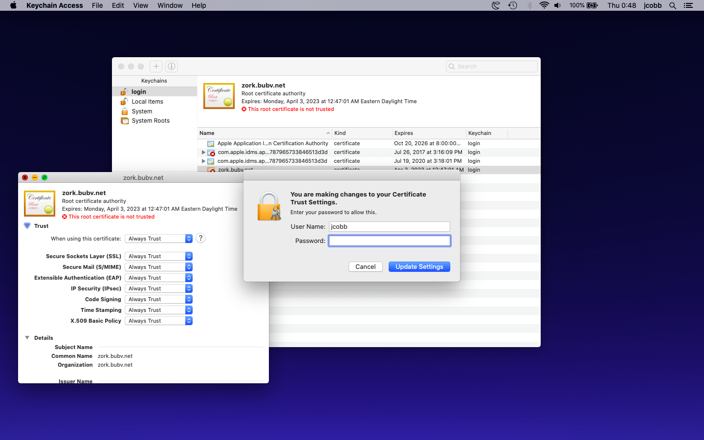

# Install your Bubble Certificate on an Apple Mac OS X system

### Download the Certificate
  * Login to your Bubble
  * Go to "Devices"
  * In the "Download Certificate" section, click "Mac OS X"
  * In the file dialog, choose "Save File", as shown below

  

  * Open the "Keychain Access" app, you should see something like the screenshot below
  
 

  * Select the "login" keychain from the "Keychains" list in the top-left panel
  * From the "File" menu, choose "Import Items...", as shown below
  
 

  * In the file selection dialog, find the Certificate file that you downloaded earlier and click "Open"
  * Right-click (or Control-Click) on the Certificate that you just added and choose "Get Info", as shown below
  
 

  * Toggle the arrow next to the "Trust" section to expand it, and the top drop-down box which reads "When using this certificate:", select "Always Trust". The screenshot below is illustrative:
  
 

  * Close the Certificate info dialog.
  * An authorization dialog will appear like the one shown below. Enter your Mac user name and password and click "Update Settings" to authorize the change.

 

  * Close the "Keychain Access" application.
  * Congratulations! You have successfully installed your Bubble certificate!
  * NOTE: if you use the Firefox web browser, you must also separately [install your Bubble Certificate in Firefox](firefox_cert.md)
