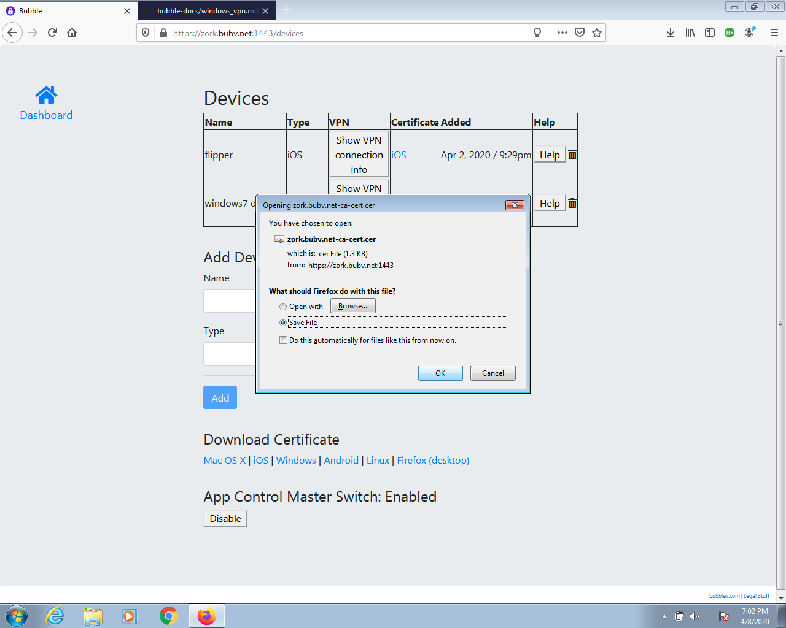
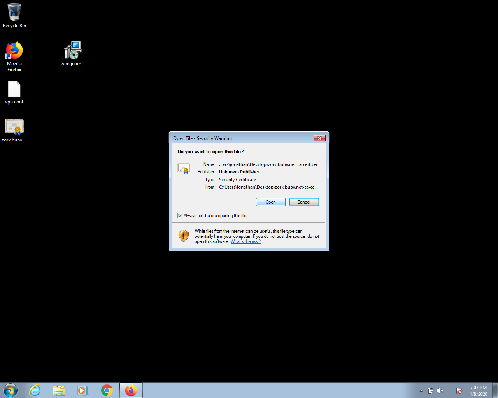
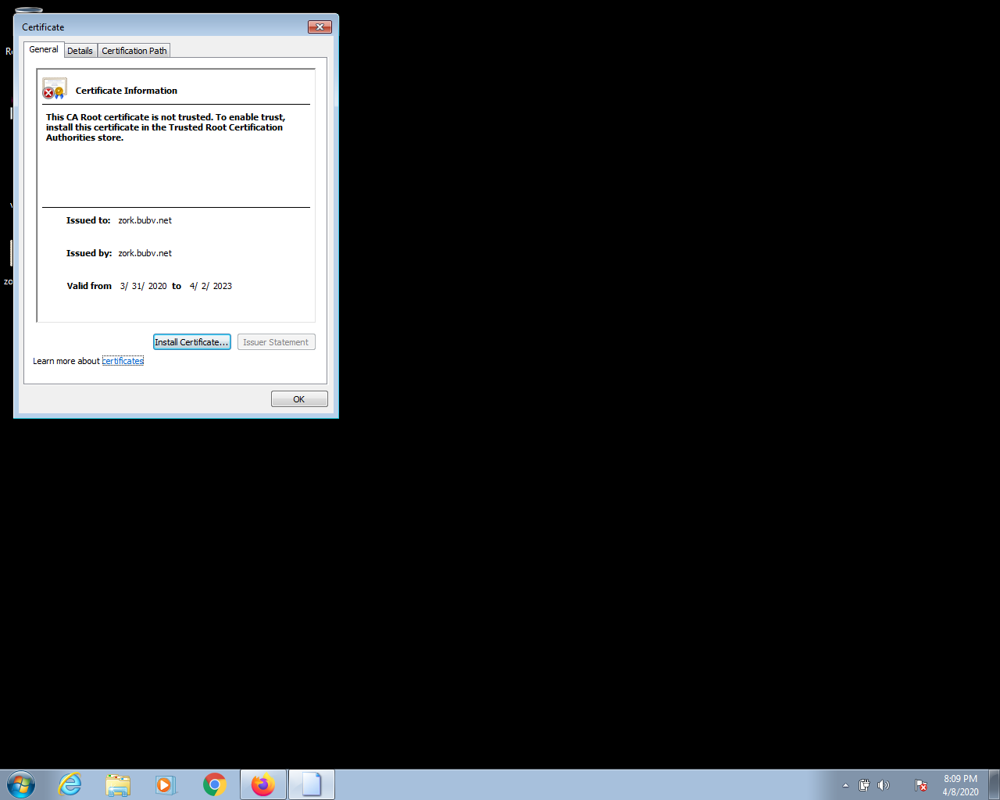
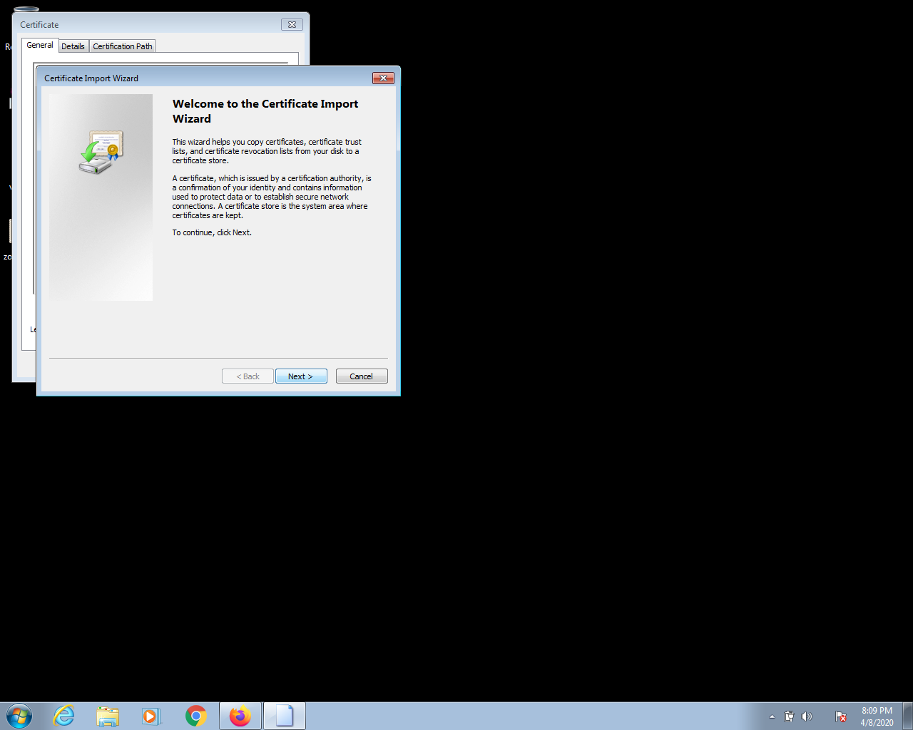
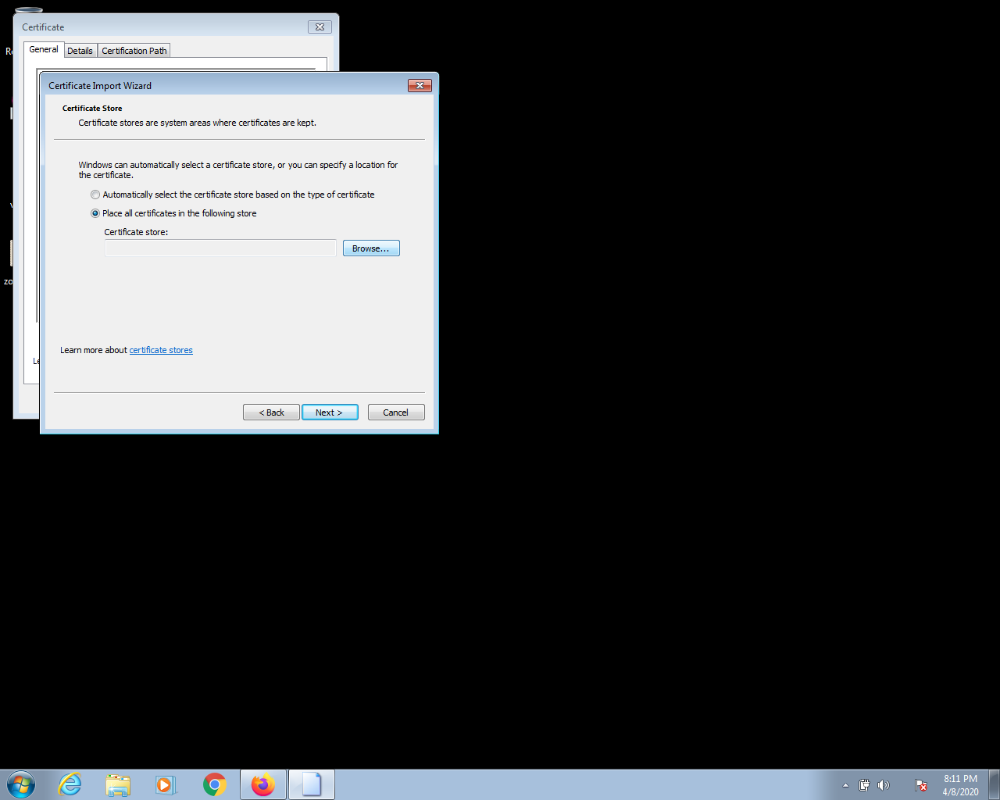
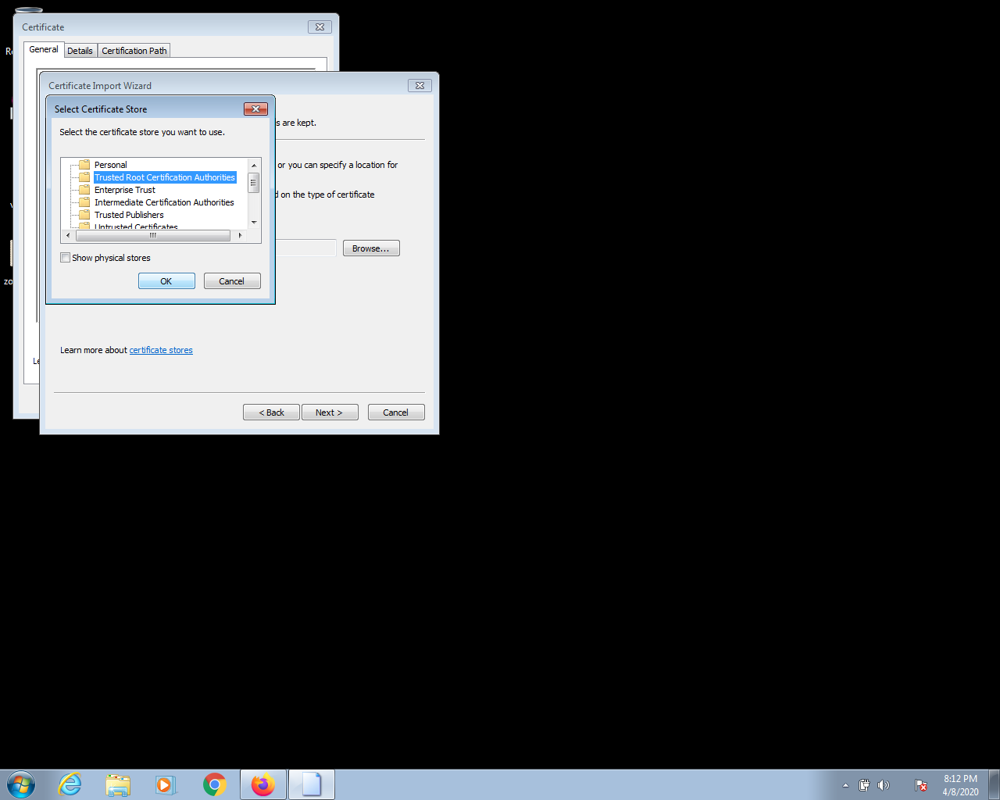
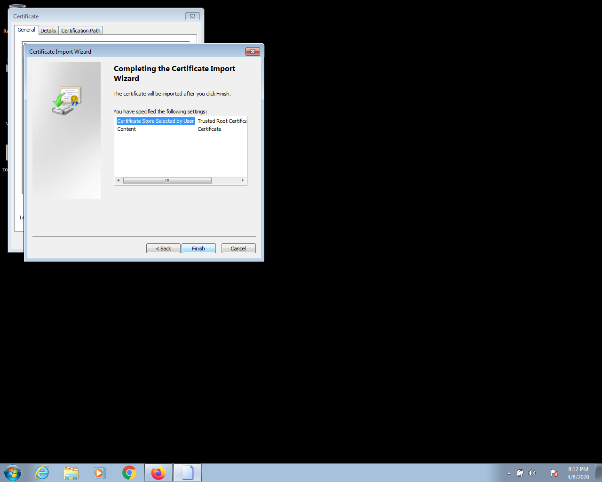
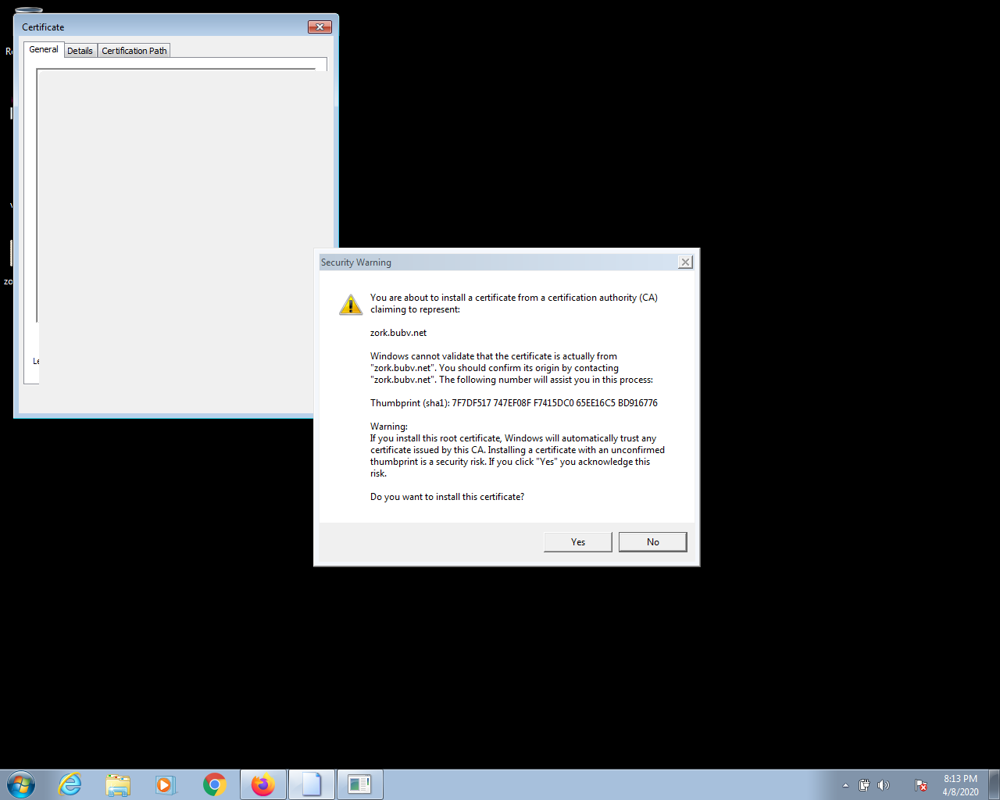
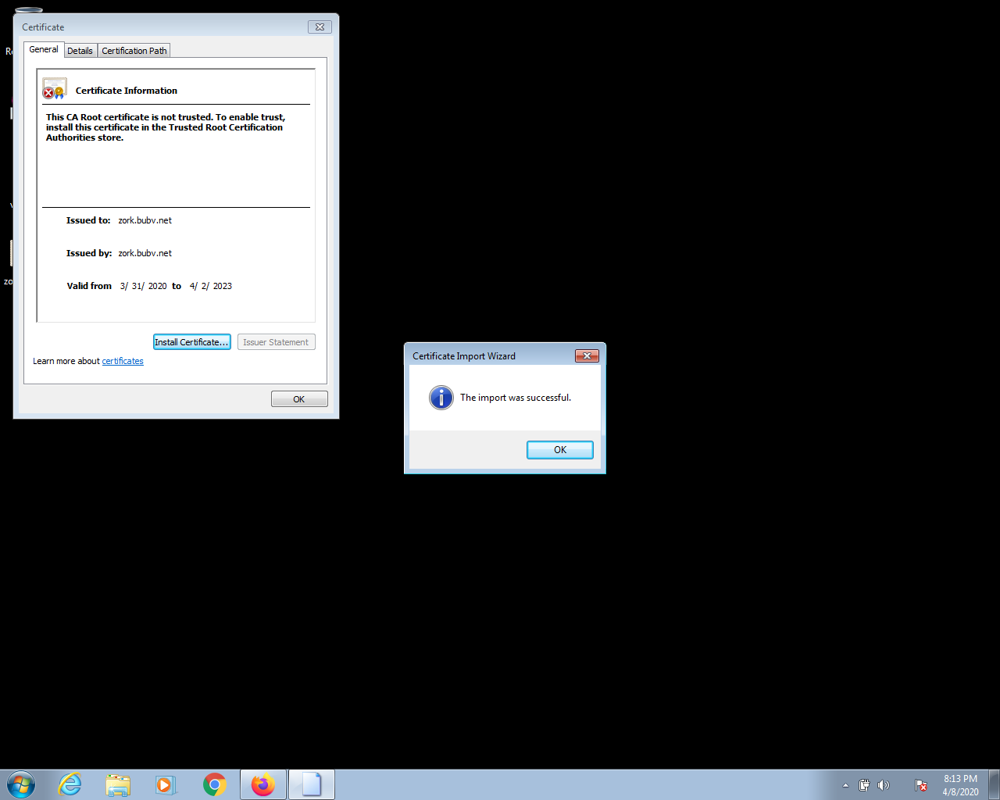

# Install your Bubble Certificate on a Microsoft Windows system

### Download the Certificate
  * Login to your Bubble
  * Go to "Devices"
  * In the "Download Certificate" section, click "Windows"
  * A download dialog like the one below will appear. Choose "Save File" and click "OK" to save the certificate file.

 

### Install the Certificate
  * Open the certificate file, you should see a dialog with the title "Open File" like the one shown below. Click "Open"
 
 

  * A "Certificate" dialog will appear like the one shown below. Click "Install Certificate..."
  
 

  * The "Certificate Import Wizard" dialog appears, as shown below. Click "Next"
  
 
  
  * The next screen will be titled Certificate Import Wizard and will look like the screenshot below. Select "Place all certificates in the following store" and click "Browse..."
  
 
 
  * Select the "Trusted Root Certification Authorities" folder as shown below, and click "OK"
  
 

  * Now you'll be returned to the Certificate Import Wizard, as shown below. You should see "Trusted Root Certification Authorities" in the "Certificate Store" text box. Click "Next"
  
 
  
  * You should now see a screen titled "Completing the Certificate Import Wizard", like the one shown below. Click "Finish"
  
 

  * Now a "Security Warning" dialog appears, as shown below. Click "Yes"
  
 

  * You should now see a dialog with the message "The import was successful", like the one below. Click "OK"

 

  * Congratulations! You have successfully installed your Bubble certificate!
  * NOTE: if you use the Firefox web browser, you must also separately [install your Bubble Certificate in Firefox](firefox_cert.md)
