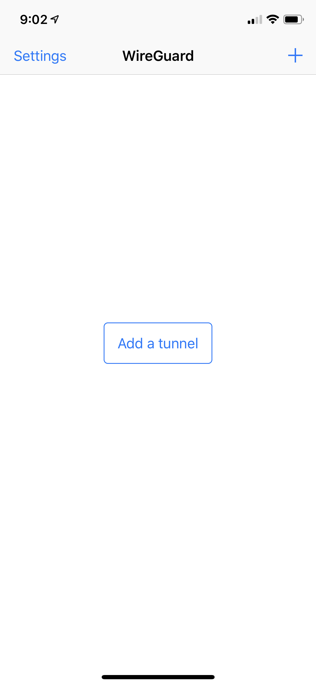
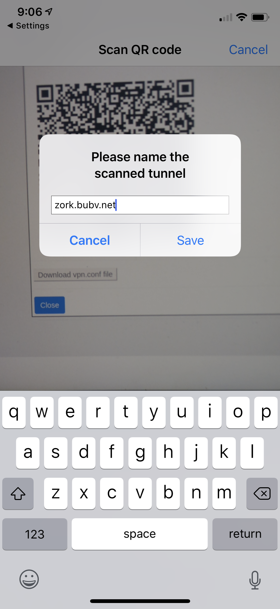
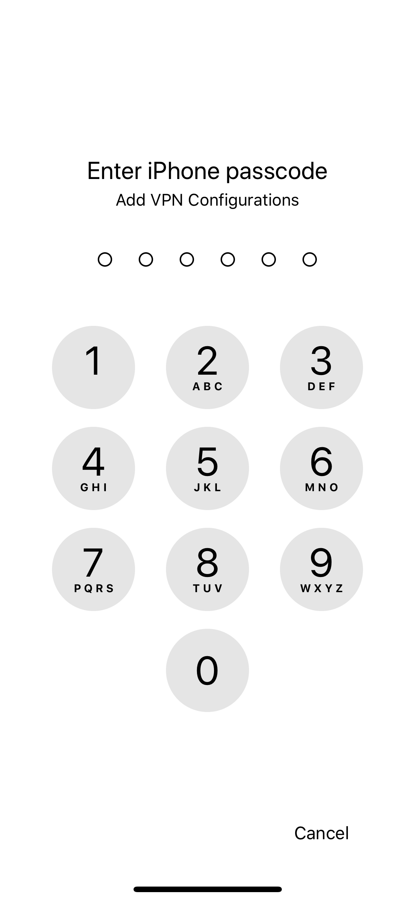
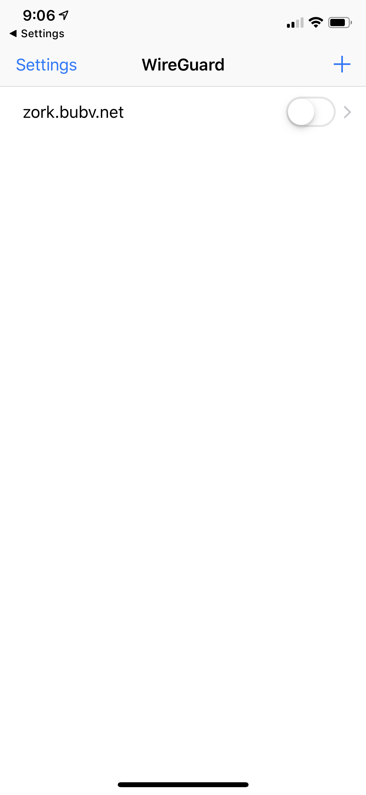

# Connect an Apple iOS device to your Bubble VPN

## Display your VPN configuration as a QR code
* On another device (not your iPhone or iPad):
   * Login to your Bubble
   * Navigate to the Devices screen
   * In the "Add Device" section, enter a name for your iOS device and click or tap the "Add" button to add it.
   * Click or tap "Show VPN connection info" for your iOS device. A QR code will appear.

## Install WireGuard
* Using your iPhone or iPad:
   * Install the WireGuard App from the [Apple App Store](https://apps.apple.com/us/app/wireguard/id1441195209)

## Connect to Bubble via WireGuard
* Using your iPhone or iPad:
   * Open the WireGuard app
   * In the WireGuard app. You should see a screen like the one shown below. Tap "Add a tunnel". If you don't see "Add a tunnel", tap the Plus icon (+) in the top-right corner of the screen.

 

   * After you tap "Add a tunnel", you should see some buttons appear at the bottom of your screen, as shown below. Tap "Create from QR code"

 
 
   * A camera view will open. Scan the QR code shown on your other device. You'll be asked to provide a name for the tunnel. You can choose anything, but it's probably easiest to use the name of your Bubble. See the screenshot below for an example.

 
 
   * You'll now see a pop-up titled "WireGuard Would Like to Add VPN Configurations", like the screenshot shown below. Tap "Allow" and then enter your passcode.

 
 
   * You'll now see your VPN connection listed, as shown below. Tap the toggle switch to turn it on.

 
 
   * Congratulations! You are now connected to your Bubble's VPN!
