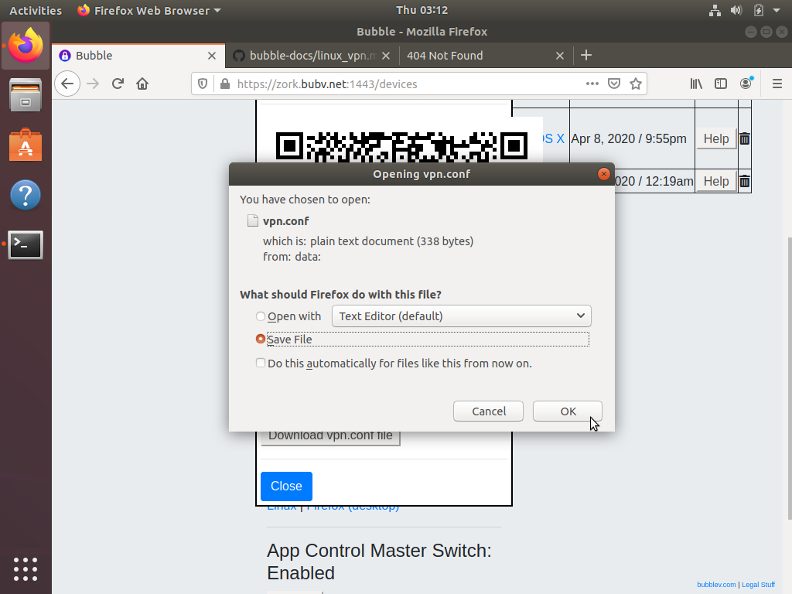

# Connect an Linux system to your Bubble VPN

## Install WireGuard
  * Install WireGuard by following the [installation instructions for your Linux distribution](https://www.wireguard.com/install/)
  * On Ubuntu systems, WireGuard also requires resolvconf to be installed, but does not install it itself. Ensure that resolvconf is installed:

        sudo apt install resolvconf

## Download the vpn.conf file
  * Login to your Bubble
  * Navigate to the Devices screen
  * Find your device in the device list, or [add your Linux system as a device](../device_setup/add_device.md)
  * Click or tap "Show VPN connection info" for your new Linux device. Click the button that reads "Download vpn.conf file" to save the `vpn.conf` file.
  * You may see a dialog box like the one shown below. If you see this, select "Save File" and click "OK".

 

## Connect to Bubble via WireGuard
  * After you have downloaded the `vpn.conf` file, as the root user, copy the file to `/etc/wireguard/wg0.conf`
  * As root, run `wg-quick up wg0`
  * Congratulations! You are now connected to your Bubble's VPN!
