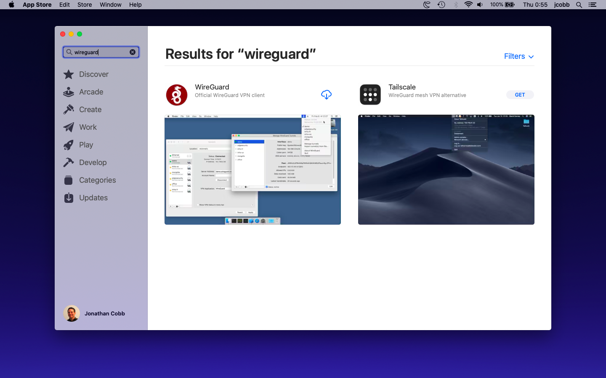
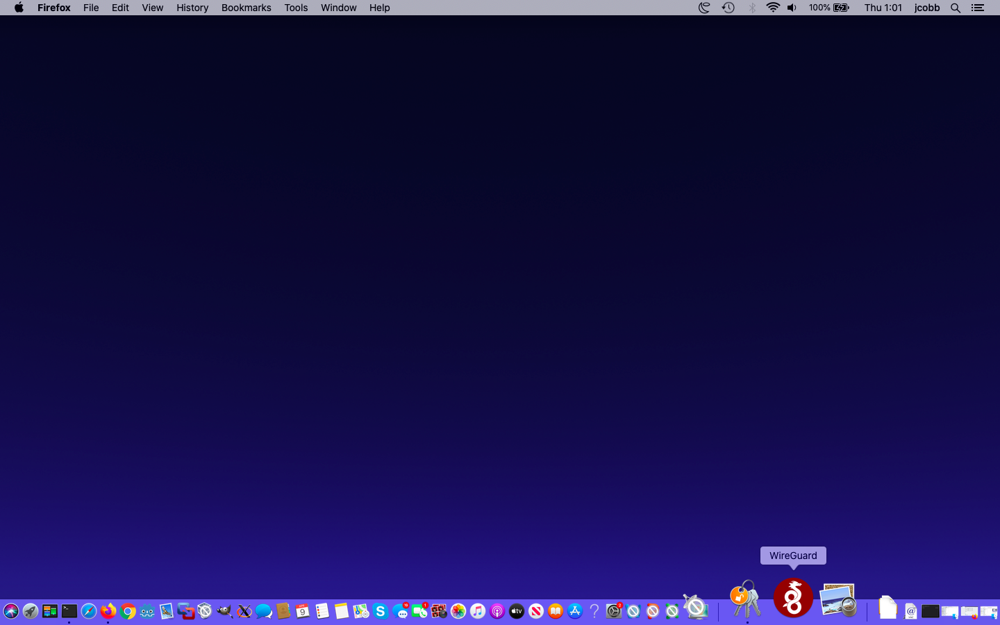
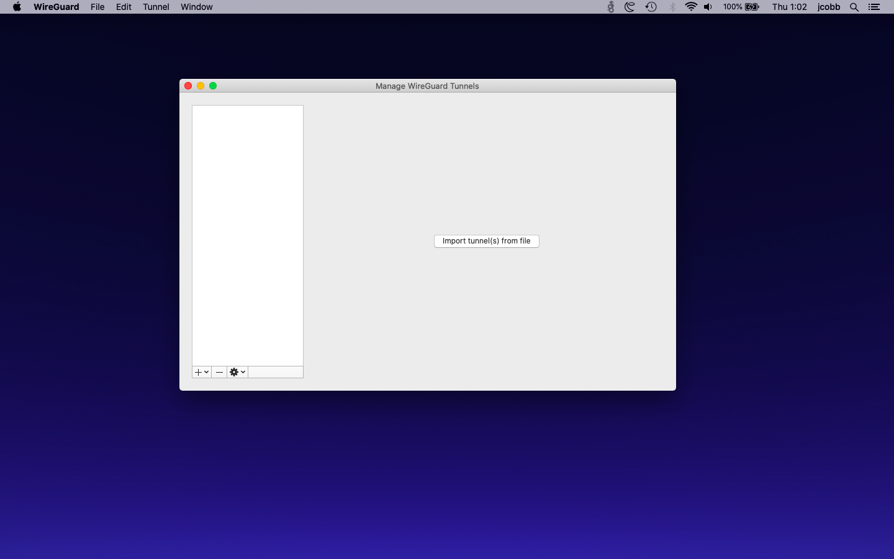
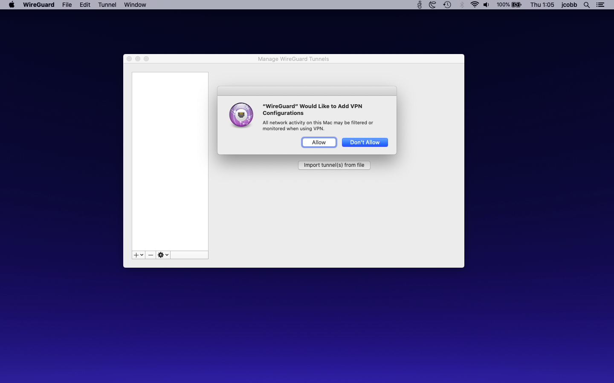
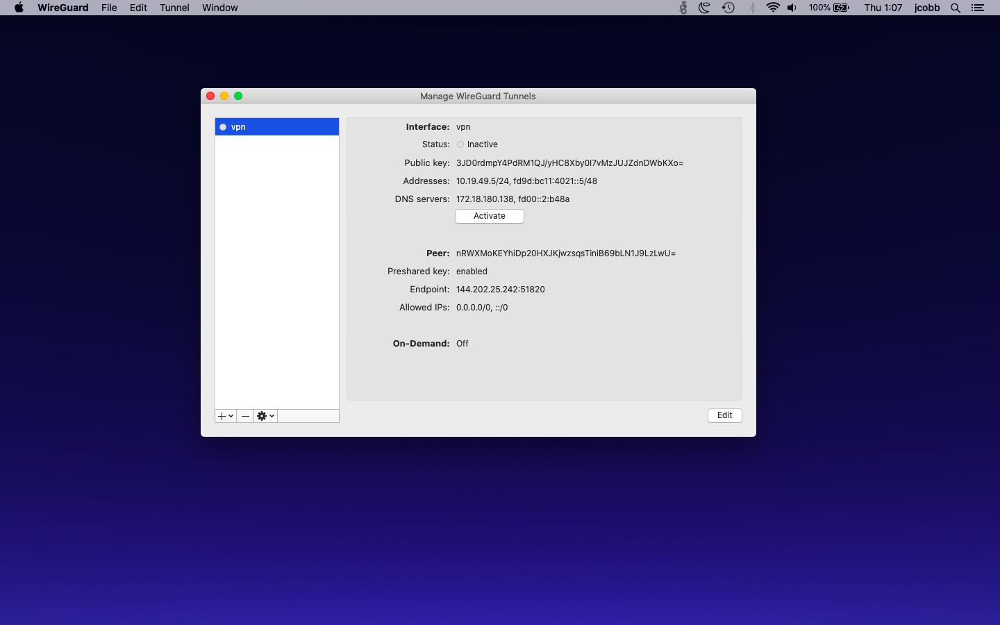
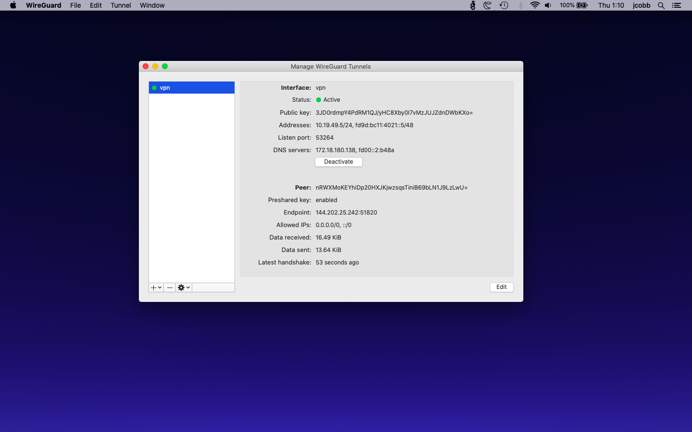
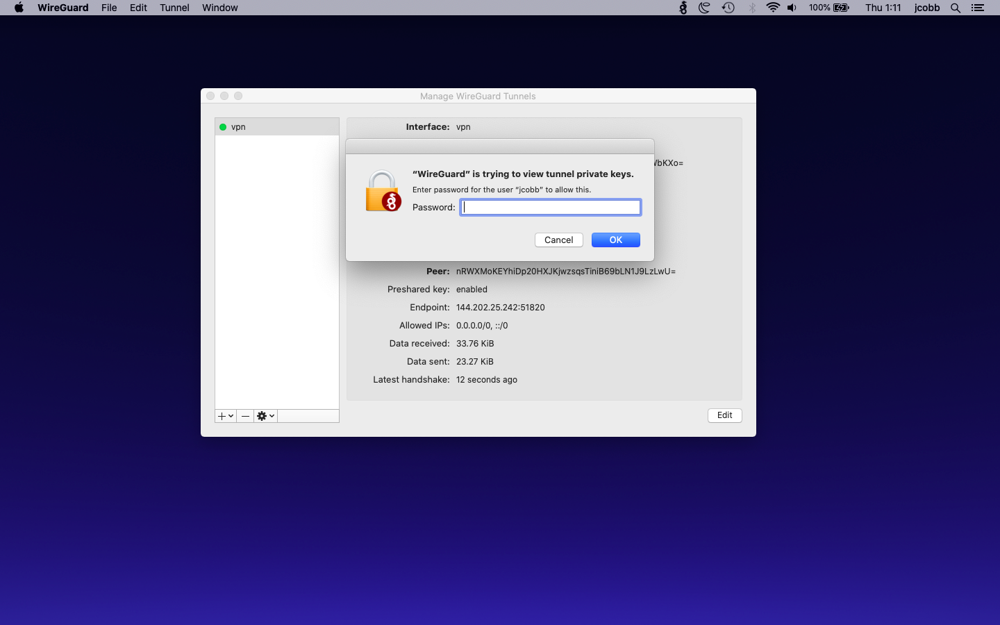
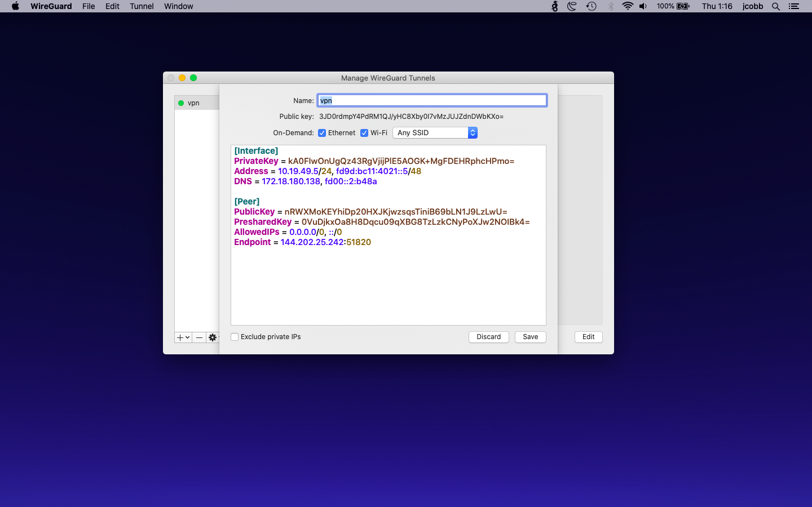

# Connect an Apple Mac OS X system to your Bubble VPN

## Download the vpn.conf file
  * Login to your Bubble
  * Navigate to the Devices screen
  * Find your device in the device list, or [add your Mac system as a device](../device_setup/add_device.md)
  * Click or tap "Show VPN connection info" for your new Mac device. Click the button that reads "Download vpn.conf file"
  * The `vpn.conf` file may simply download automatically, or you may be asked if you want to Open or Save the file. If you are asked to Open or Save, choose Save to save the `vpn.conf` file to your computer.

## Install WireGuard
  * Download and install WireGuard from the [Mac App Store](https://itunes.apple.com/us/app/wireguard/id1451685025?ls=1&mt=12)
  * If the above link did not work:
    * Open the App Store app on your Mac
    * Search for "wireguard"
    * You should see a screen like the one below. Install WireGuard. 

 

## Connect to Bubble via WireGuard
  * Open the WireGuard application if it is not already open. You may find a WireGuard icon in your dock, as shown below. Click it to open WireGuard.

 

  * The WireGuard app should now open. You'll see a screen like the one shown below. Click the "Import tunnel(s) from file" button

 

  * In the file selection dialog, select the `vpn.conf` file that you downloaded above, and click the "Import" button
  
  * You'll now see a dialog requesting your approval for WireGuard to add a VPN configuration, like the screenshot below. Click "Allow"

 

  * You should now see the WireGuard screen with your new VPN added, like the screenshot below

 

  * Click the "Activate" button to connect to the VPN. The "Status" indicator should change to a green dot with the word "Active" next to it. An example screenshot is shown below.

 

  * Click the "Edit" button in the bottom right corner of the WireGuard screen
  * You should see a dialog asking you for your password, like the one below. Enter your password and click "OK"

 

  * You should now see a screen to edit the VPN settings like the one shown below. Don't change anything in the big text box. Above the text box, you should see "On-Demand" with a couple of checkboxes. Check both checkboxes "Ethernet" and "Wi-Fi", and click "Save"

 

  * Congratulations! You are now connected to your Bubble's VPN!
