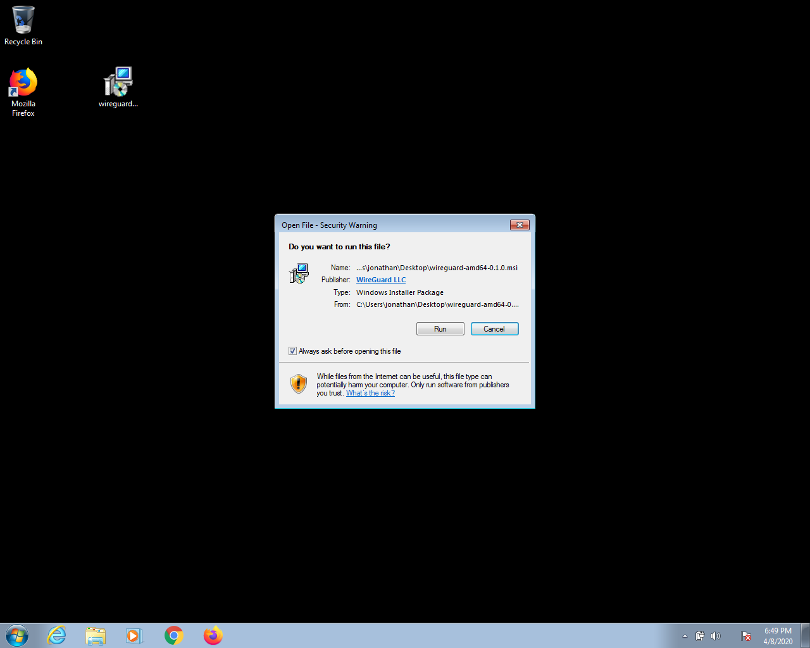
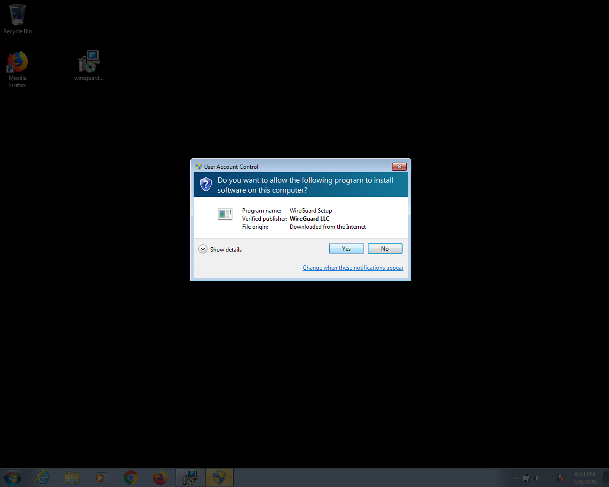
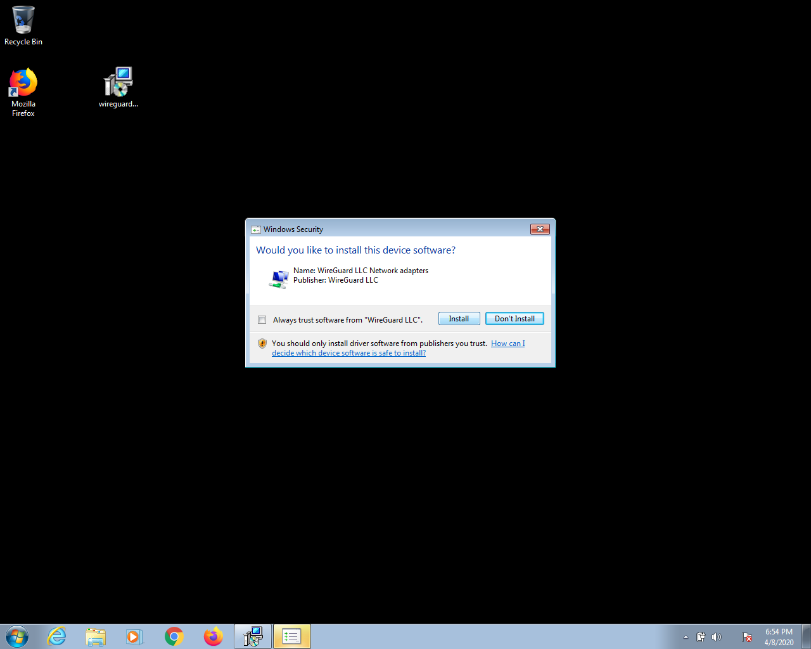
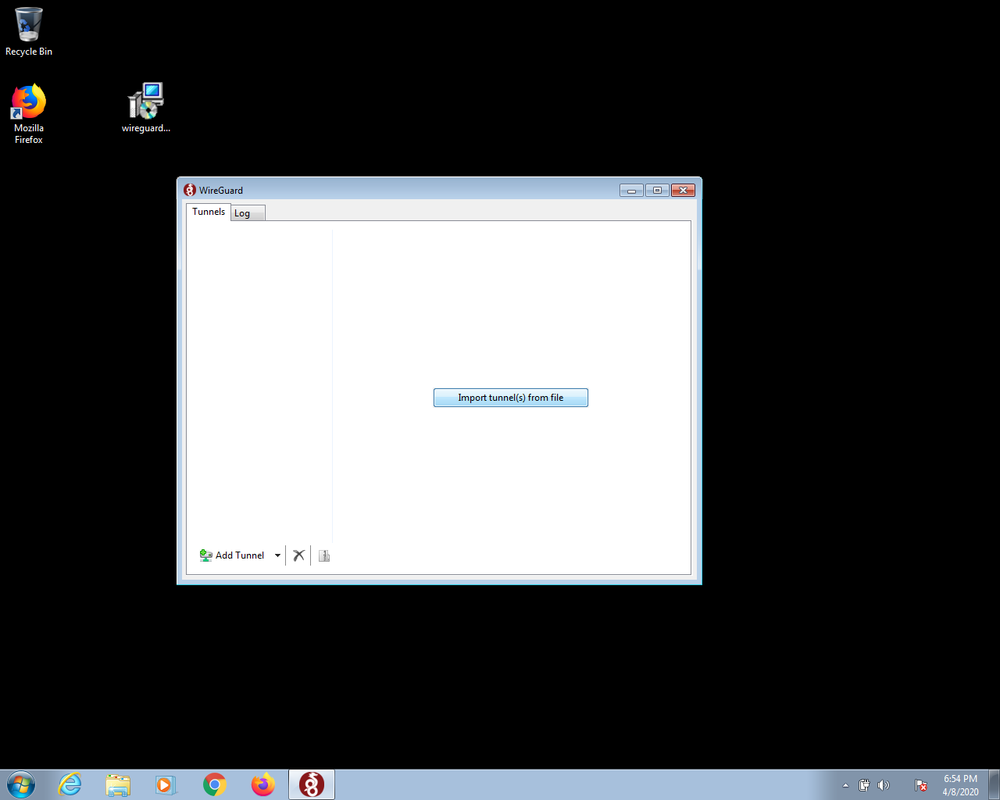
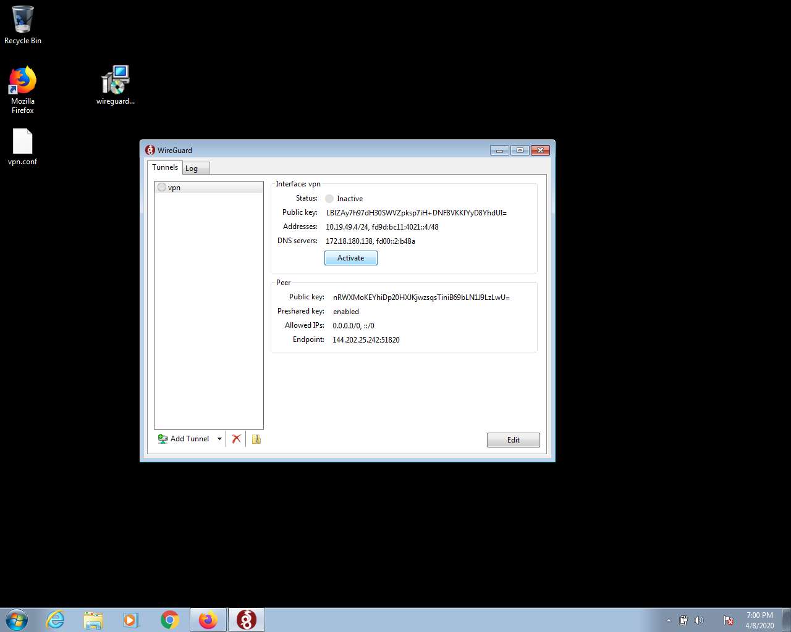
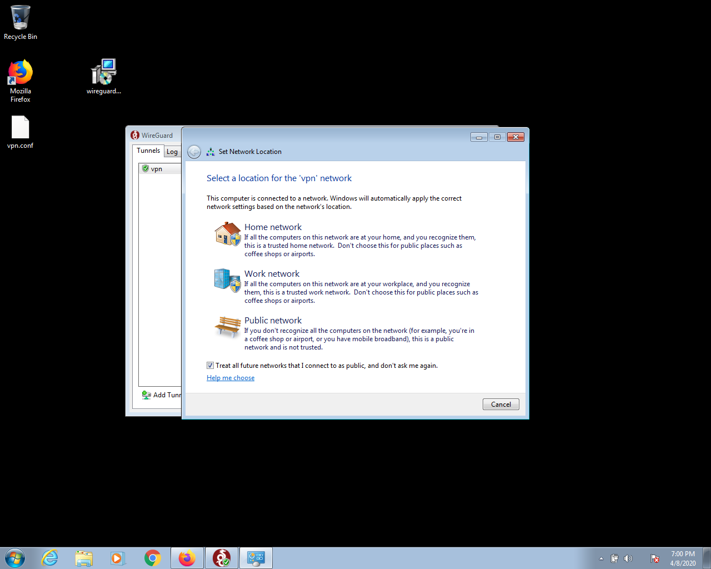
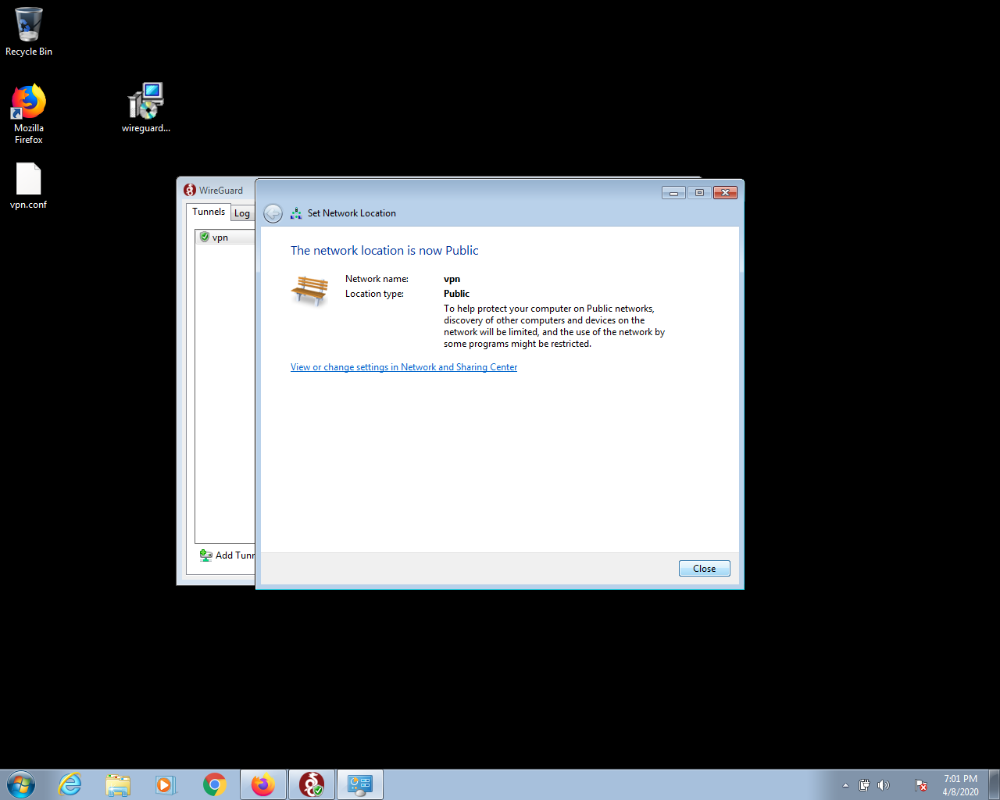

# Connect a Microsoft Windows system to your Bubble VPN

## Download the vpn.conf file
  * Login to your Bubble
  * Navigate to the Devices screen
  * Find your device in the device list, or [add your Windows system as a device](../add_device.md)
  * Click or tap "Show VPN connection info" for your new Windows device. Click the button that reads "Download vpn.conf file". A dialog will appear similar to the one shown below. 
  

  * Choose "Save File" and save the vpn.conf file to your computer.

## Install WireGuard
  * Download and install [WireGuard for Windows](https://download.wireguard.com/windows-client/wireguard-amd64-0.1.0.msi)
    * Note: If you are running a 32-bit version of Windows, you must install the [32-bit version of Wireguard](https://download.wireguard.com/windows-client/wireguard-x86-0.1.0.msi)
    * Most newer Windows systems are 64-bit. To determine if your Windows is 64-bit or 32-bit, [follow these instructions](https://www.lifewire.com/am-i-running-a-32-bit-or-64-bit-version-of-windows-2624475)
    * You can find more information about the WireGuard installers on the [WireGuard Installation page](https://www.wireguard.com/install/)
  * Run the WireGuard msi installer that you just downloaded. You'll see a screen similar to the one shown below.
  

  * Click "Open"  
  

  * Click "Yes"
  

  * Click "Install"  
  * The WireGuard application then opens, and you should see a screen like the one below.
    

## Connect to Bubble via WireGuard
  * In the WireGuard application, click "Import tunnels(s) from file", and select the vpn.conf file that you downloaded. You should now see a screen like the one shown below.
  

  * Click the "Activate" button to connect to the VPN.
  * You should now see a "Set Network Location" dialog, like the one shown below. Click on "Public network", then click the "Close" button.
  

  * The next screen will ask you to confirm this network location. It should look like the screenshot below. Click "Close".
  
  
  * Congratulations! You are now connected to your Bubble's VPN!
